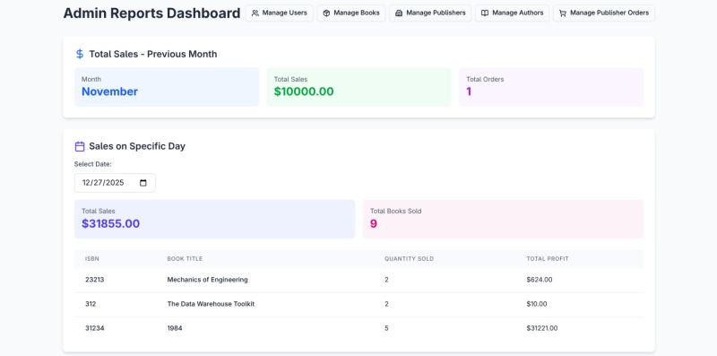
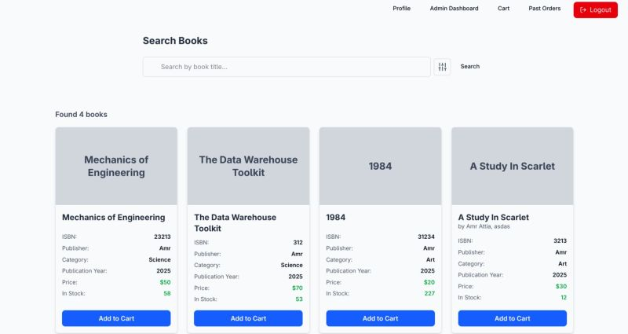
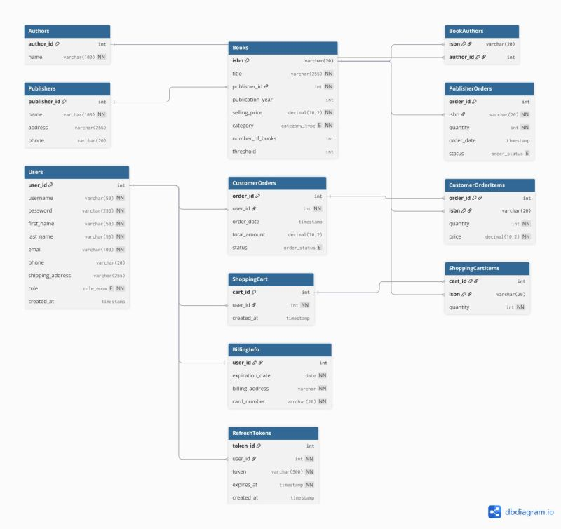
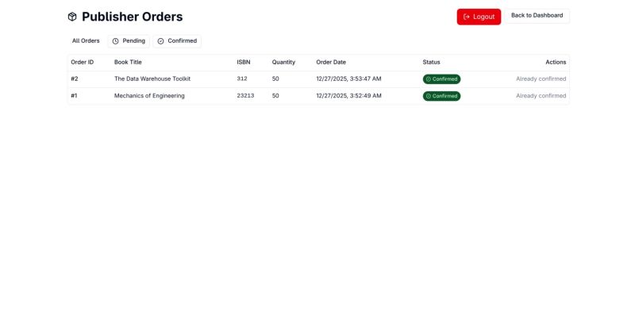
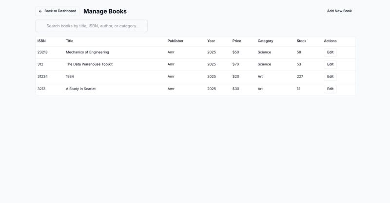

# 📚 Full-Stack Online Bookstore

A production-style full-stack order processing system built as a Database Course Final Project.

The platform supports secure authentication, role-based access control, order processing, analytics dashboards, and a fully containerized deployment setup.

---

# 🚀 Features

- JWT Authentication with refresh tokens
- Role-Based Access Control (Admin & Customer)
- Shopping cart and secure checkout
- Order history and inventory management
- Admin analytics dashboard
- PostgreSQL triggers, ENUMs, and transactions
- Fully Dockerized 3-tier architecture

---

# 🛠 Tech Stack

### Backend
- Java 17
- Spring Boot
- Spring Security
- JDBC Template

### Frontend
- Next.js 14
- TypeScript
- Tailwind CSS
- shadcn/ui

### Database & DevOps
- PostgreSQL
- Docker & Docker Compose

---

# 🖼️ Screenshots

## 📊 Admin Reports Dashboard


## 🔎 Book Search Page


## 🗂️ Database ERD


## 📦 Publisher Order Page


## 📚 Manage Books Page


---

# ⚙️ Run Locally

```bash
docker compose up --build
```

Then go to this [http://localhost:3000](http://localhost:3000) 